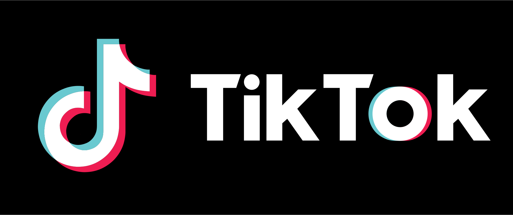

<h1 align="center">
  
</h1>

  

  

  

  

  

  

 

## 💻 Projeto

Esse projeto foi feito para treinar a minha habilidade de criação de UI's mobile React Native, foi escolhido o app do tiktok pelo seu feed de vídeos na screen home, sendo assim seria muito produtivo realizar esse clone!

 

## 📱 Preview

<h1 align="center">
    
</h1>

## 🚀 Tecnologias

Esse projeto foi desenvolvido com as seguintes tecnologias:

- [React Native](https://reactjs.org)
- [Styled Components](https://styled-components.com/)
- [React Navigation](https://reactnavigation.org/docs/getting-started/)

 

  Made with 🖤 by <a href="https://www.linkedin.com/in/ronnyacacio/"> Ronny Acácio </a>

